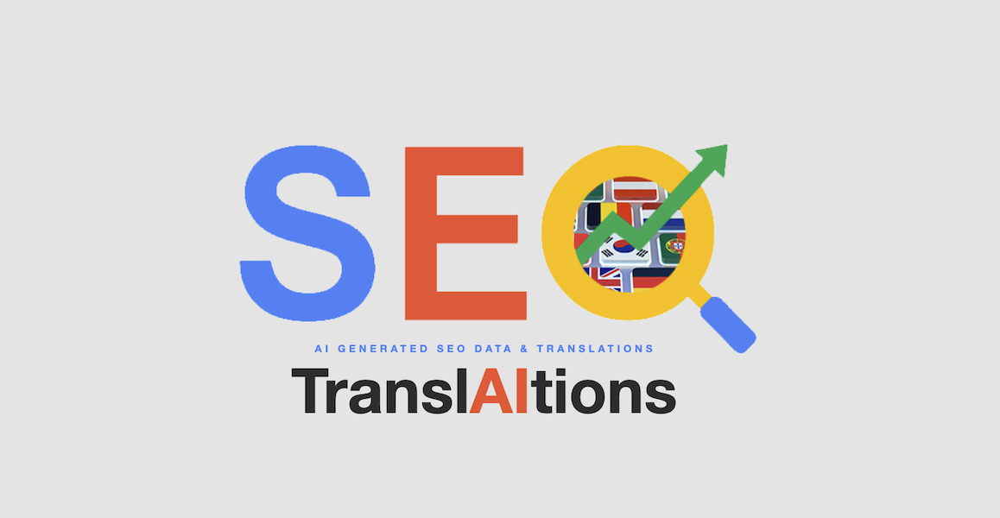

# SEO TranslAItions

URBN 2023 Hackathon entry. Translate text from English to another Language using AI, or generate brand new SEO content. Ultimately this will replace a very manual process by automating the generation and translation of text when content is saved via CMS.

## Setup

1. Add a `.env` file using `.env.example` as a template.
2. Add your OpenAI API key to `OPENAI_API_KEY`
   - [Generate one](https://platform.openai.com/account/api-keys) if needed
3. Install the dependencies:

```bash
npm ci
```

## Development Server

Start the development server on `http://localhost:3000`:

```bash
npm run dev
```
